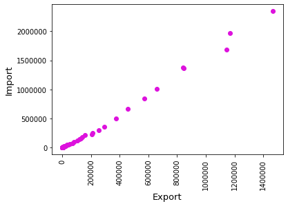
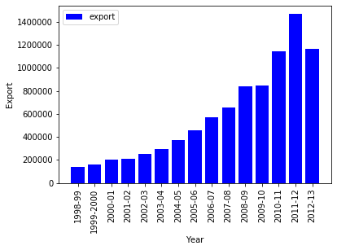
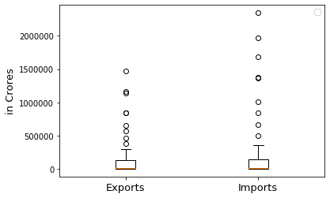

* * *
## Module 4 : Assignment
* * *

> **AIM:- To download a dataset from www.data.gov.in and do the following**
>> Make a scatterplot, barchart and boxplot and draw inferences from it.

### Part1: - Dataset
> The dataset is downloaded from www.data.gov.in.

### Files
> All the files are contained in the zip folder **module4**
1.  **data.csv** is the file containing all the data. The file is same as downloaded from website..
2.  **ds200.py** is the file containing python code for the creating the graphs using _matplotlib_ library.
3.   **ds200.ipynb** in the file containing python code from Jupyter Notebook.

### Part2: - Scatter Plot
> Below is scatterplot.

 1.The plot has **Export since 1949-50 ** vs ** Import since 1949-50** .The data provides the Exports, Imports and Trade Balance (Rs. Cr.) since 1949-50 to 2012-13 from last 64 years.
 
 2. The number of Exports for a state are highly correlated with The number of imports. .
* * *

* * *
### Part3: - Bar Chart
> Below is the Barchart which shows Export vs years.

This Barchart which shows Export done in Years from last 16 years (1998-99 to 2012-13) for state kolkata.
### Part4: - Box Plot

The plot shows the box plot of **Export and Imports** with years for last 64 year(1998-99 to 2012-13) for kolkata state.

